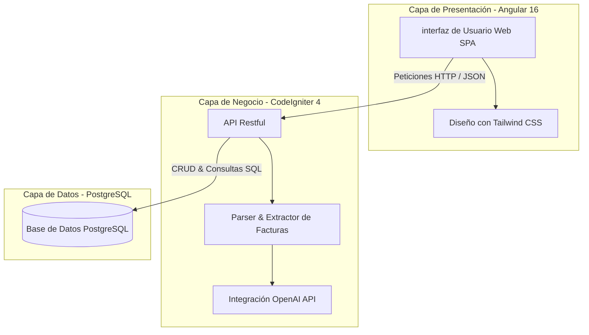
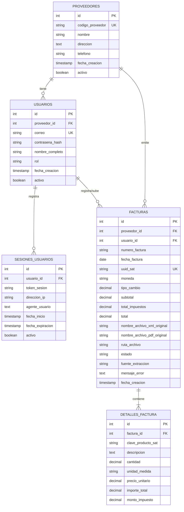
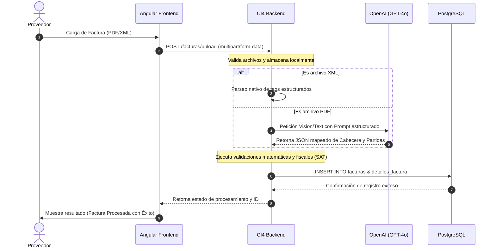

# 📑 Portal de Proveedores — Sistema de Procesamiento de Facturas con IA

¡Bienvenido al **Portal de Proveedores**! Una solución empresarial integral y de alto rendimiento diseñada para la **gestión, extracción, procesamiento y validación automatizada de facturas** (XML y PDF) mediante Inteligencia Artificial.

Este sistema permite a los proveedores subir sus facturas directamente, automatizando la digitalización y el análisis de partidas a través de modelos de lenguaje avanzados (LLM - GPT-4o). El sistema valida la información matemática y fiscal contra regulaciones del SAT y almacena los datos estructurados en una base de datos centralizada.

---

## 🛠️ Arquitectura del Sistema

El proyecto está diseñado bajo una arquitectura desacoplada y moderna que garantiza escalabilidad, seguridad y una experiencia de usuario sobresaliente:



---

## 💾 Modelo de Datos (Esquema PostgreSQL)

La base de datos centralizada corre en **PostgreSQL** y maneja el siguiente esquema relacional de entidades para auditoría, control de accesos e información de facturación:



---

## 📂 Estructura del Proyecto

El repositorio está organizado de forma clara y modular:

```text
portal_proveedores/
├── Backend_PortalProveedores/     # Backend en CodeIgniter 4 (PHP 8.1+)
│   ├── app/                       # Controladores, Modelos, Vistas y Configuración
│   ├── public/                    # Punto de entrada público (index.php) y assets
│   ├── writable/                  # Caché, Logs, Sesiones y archivos temporales
│   ├── .env.example               # Plantilla segura de configuración de entorno
│   └── composer.json              # Dependencias del backend
├── Frontend_PortalProveedores/    # SPA Frontend en Angular 16
│   ├── src/                       # Código fuente de Angular (Componentes, Servicios, Estilos)
│   ├── tailwind.config.js         # Configuración de estilos visuales
│   └── package.json               # Dependencias de npm
├── database/                      # Scripts y definición de base de datos
│   └── schema.sql                 # Esquema de base de datos de PostgreSQL
└── README.md                      # Documentación del proyecto (este archivo)
```

---

## ⚡ Guía de Instalación y Configuración

Sigue estos pasos detallados para configurar y levantar el proyecto en tu entorno de desarrollo local.

### 📋 Requisitos Previos

Asegúrate de tener instalados los siguientes componentes en tu sistema:
- **PHP 8.1 o superior** (con extensiones habilitadas: `intl`, `mbstring`, `curl`, `openssl`, `pdo_pgsql`, `pgsql`).
- **Composer** (gestor de dependencias de PHP).
- **Node.js** (v18.x recomendado) y **npm**.
- **Angular CLI** (v16.2.x).
- **PostgreSQL** (v12 o superior).

---

### 1. Configuración de la Base de Datos (PostgreSQL)

1. Crea una nueva base de datos en PostgreSQL (por ejemplo, `datagl`).
2. Crea el esquema necesario ejecutando el archivo SQL:
   ```bash
   psql -U tu_usuario -d datagl -f database/schema.sql
   ```

---

### 2. Configuración del Backend (CodeIgniter 4)

1. Navega al directorio del backend:
   ```bash
   cd Backend_PortalProveedores
   ```
2. Instala las dependencias del proyecto usando Composer:
   ```bash
   composer install
   ```
3. Configura el archivo de entorno:
   - Copia la plantilla segura:
     ```bash
     cp .env.example .env
     ```
   - Abre el archivo `.env` y edita las siguientes variables con tus credenciales y llaves correspondientes:
     ```env
     # Entorno (development / production)
     CI_ENVIRONMENT = development

     # URL Base del servidor
     app.baseURL = 'http://localhost:8080/'

     # Conexión a Base de Datos PostgreSQL
     database.default.hostname = localhost
     database.default.database = datagl
     database.default.username = postgres
     database.default.password = tu_contraseña
     database.default.DBDriver = Postgre
     database.default.port = 5432
     database.default.schema = portal_prov

     # API Key de OpenAI (para el parsing inteligente de PDF)
     AI_API_KEY = tu_openai_api_key_real
     AI_API_URL = https://api.openai.com/v1/chat/completions
     AI_MODEL = gpt-4o
     ```
4. Levanta el servidor local de CodeIgniter:
   ```bash
   php spark serve
   ```
   El backend estará disponible en `http://localhost:8080/`.

---

### 3. Configuración del Frontend (Angular 16)

1. Navega al directorio del frontend:
   ```bash
   cd ../Frontend_PortalProveedores
   ```
2. Instala los paquetes y dependencias de node:
   ```bash
   npm install
   ```
3. Si el puerto del backend es diferente o necesitas cambiar las API endpoints, configura los ambientes de Angular en `src/environments/`.
4. Corre el servidor de desarrollo local:
   ```bash
   npm start
   # o bien:
   ng serve
   ```
5. Abre tu navegador e ingresa a `http://localhost:4200/` para interactuar con la aplicación.

---

## 🤖 Flujo de Procesamiento Inteligente de Facturas

El núcleo del sistema es la digitalización y el mapeo inteligente de los conceptos de la factura:



---

## 🔒 Buenas Prácticas de Seguridad en Producción

- **Protección de Secretos**: Nunca agregues archivos `.env`, `.env.production` o credenciales a este repositorio. Asegúrate de que el `.gitignore` raíz siempre esté activo.
- **Configuración de SSL/TLS**: En producción, habilita siempre `app.forceGlobalSecureRequests = true` en tu archivo `.env` para cifrar el tráfico.
- **Auditoría**: Todas las acciones de sesión quedan grabadas en la tabla `sesiones_usuarios` con direcciones IP y agentes de usuario para trazabilidad forense.
